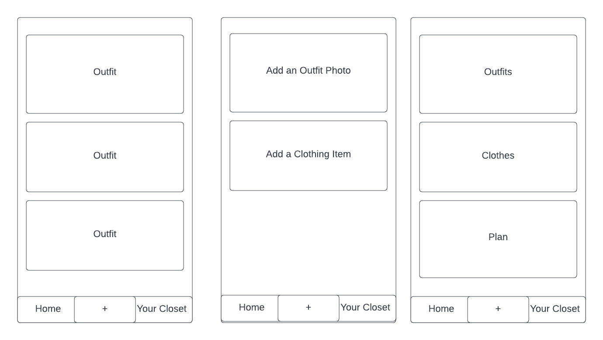

# Finspo           

## Contributers
* Daniel Yakovlev

## Description
An Android application that allows users to store outfits they have worn and clothes to reference them in the future or post them publically so others can have inspiration for their outfits         

## Technologies Used

* React Native
* Android
* Expo
* CSS 
* Javascript

## Diagram


## Setup/Installation Requirements

* Clone this repo to your workspace.
* Navigate to the top level of the directory.
* In the root directory of the project, run:
```
$ npm install
```
* Then, to build and serve the project, run: 
```
$ npx expo start
```
* Download Expo Go app
* Connect to Expo server with QR code in terminal


## Known Bugs
* Photos and outfits wont save persistently

## License

MIT License

Copyright (c) 2023 Daniel Yakovlev


Permission is hereby granted, free of charge, to any person obtaining a copy
of this software and associated documentation files (the "Software"), to deal
in the Software without restriction, including without limitation the rights
to use, copy, modify, merge, publish, distribute, sublicense, and/or sell
copies of the Software, and to permit persons to whom the Software is
furnished to do so, subject to the following conditions:

The above copyright notice and this permission notice shall be included in all
copies or substantial portions of the Software.

THE SOFTWARE IS PROVIDED "AS IS", WITHOUT WARRANTY OF ANY KIND, EXPRESS OR
IMPLIED, INCLUDING BUT NOT LIMITED TO THE WARRANTIES OF MERCHANTABILITY,
FITNESS FOR A PARTICULAR PURPOSE AND NONINFRINGEMENT. IN NO EVENT SHALL THE
AUTHORS OR COPYRIGHT HOLDERS BE LIABLE FOR ANY CLAIM, DAMAGES OR OTHER
LIABILITY, WHETHER IN AN ACTION OF CONTRACT, TORT OR OTHERWISE, ARISING FROM,
OUT OF OR IN CONNECTION WITH THE SOFTWARE OR THE USE OR OTHER DEALINGS IN THE
SOFTWARE.

Capstone proj

Name of Student: Daniel Yakovlev  

Name of Project: Finspo

Project's Purpose or Goal: (What will it do for users?)
* It will allow users to upload pictures of their outfits and create a list of clothes in the outfit so they can easily create new outfits
* It will allow for users to publish outfits and list the clothing items and where to get them

List the absolute minimum features the project requires to meet this purpose or goal:
* Upload pictures and under each image list the clothes theyre wearing
* Have a public section that allows you to see outfits other people have published publically
* allow users to see what outfits someone has published 
* Have the App published on the google play store

What tools, frameworks, libraries, APIs, modules and/or other resources (whatever is specific to your track, and your language) will you use to create this MVP? List them all here. Be specific.
* React Native
* Expo
* .Net for backend API
* MySql for published outfits

If you finish developing the minimum viable product (MVP) with time to spare, what will you work on next? Describe these features here: Be specific.
* I will add the ability to search for out fits and have tags for outfits for users to more easily find things
* A nosql server for caching

What additional tools, frameworks, libraries, APIs, or other resources will these additional features require?
* elasticsearch
* Redis

8:18 am looked at https://reactnative.dev/docs/environment-setup to create a react native app

9:10 am looked at https://reactnative.dev/docs/components-and-apis 

3:02 pm started watching https://www.youtube.com/watch?v=VozPNrt-LfE&ab_channel=Academind

3:55 pm 39:52 into https://www.youtube.com/watch?v=VozPNrt-LfE&ab_channel=Academind

### Friday 24 Feb
1:05 pm started reading https://www.reactnativeschool.com/how-to-upload-images-in-a-react-native-app
1:50 pm finished reading https://www.reactnativeschool.com/how-to-upload-images-in-a-react-native-app
1:54 pm started reading https://www.waldo.com/blog/add-an-image-picker-react-native-app
2:37 pm finished reading https://www.waldo.com/blog/add-an-image-picker-react-native-app
